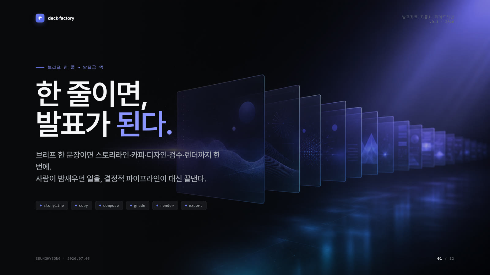
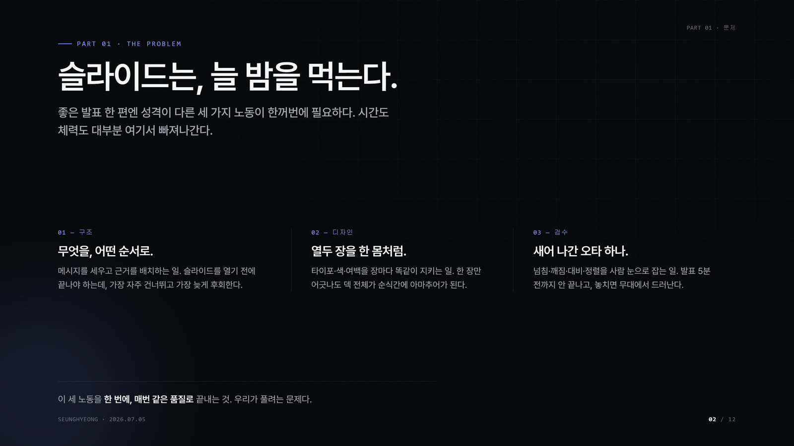
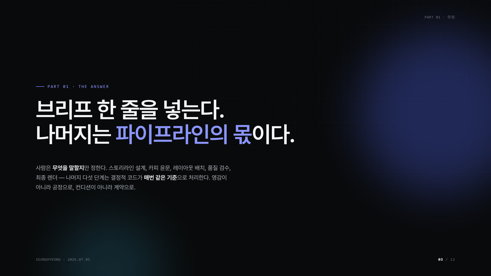
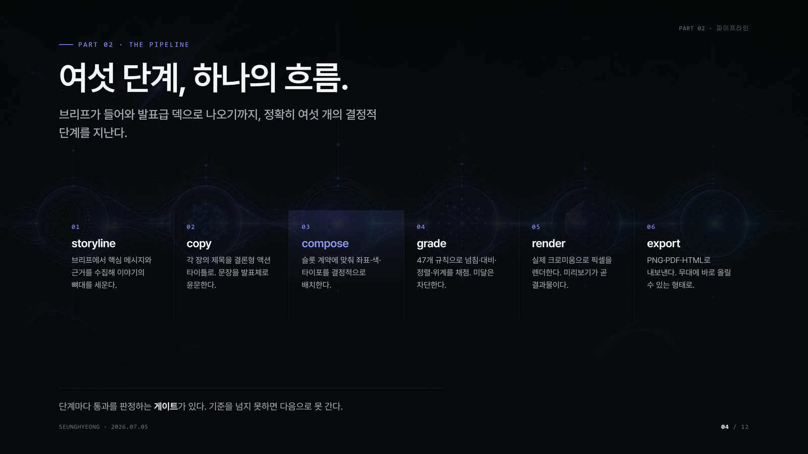
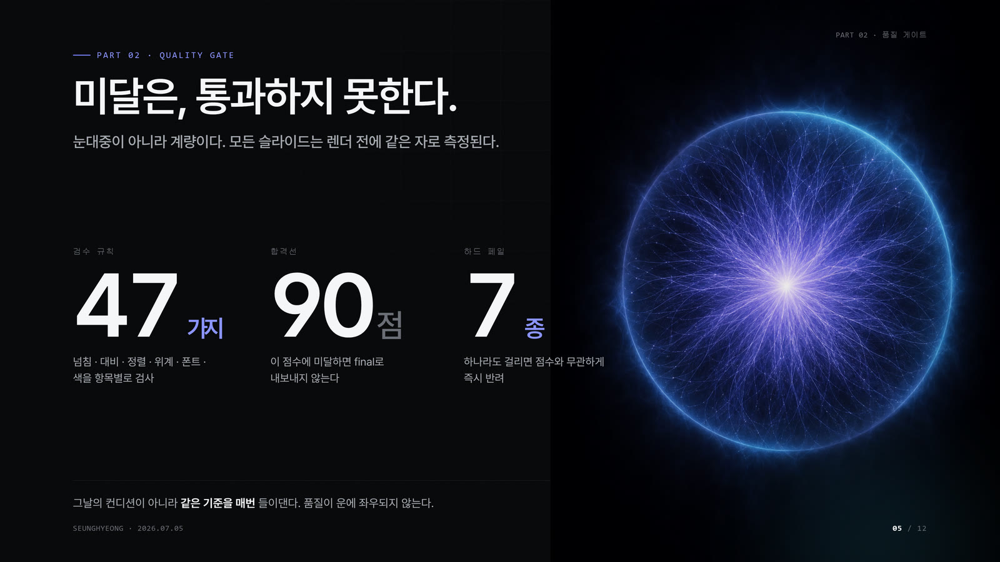
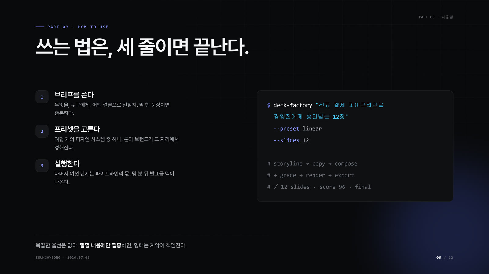
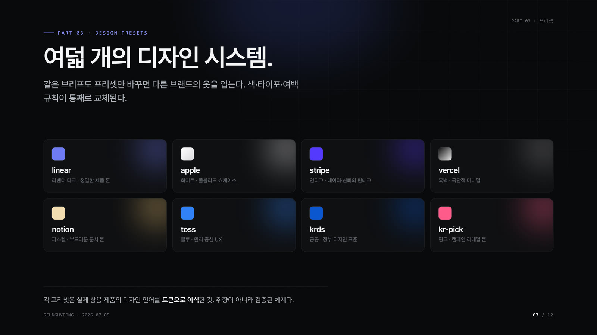
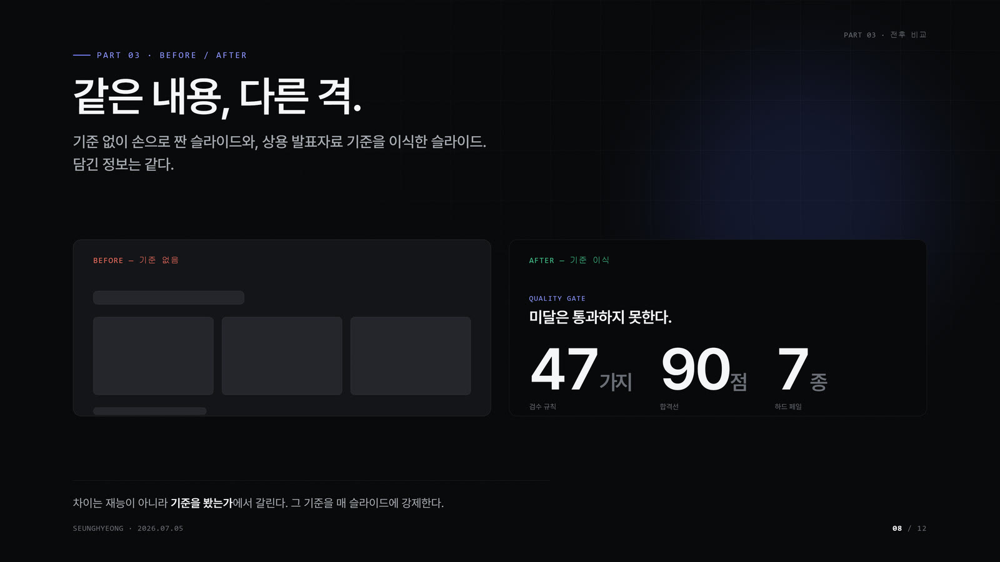
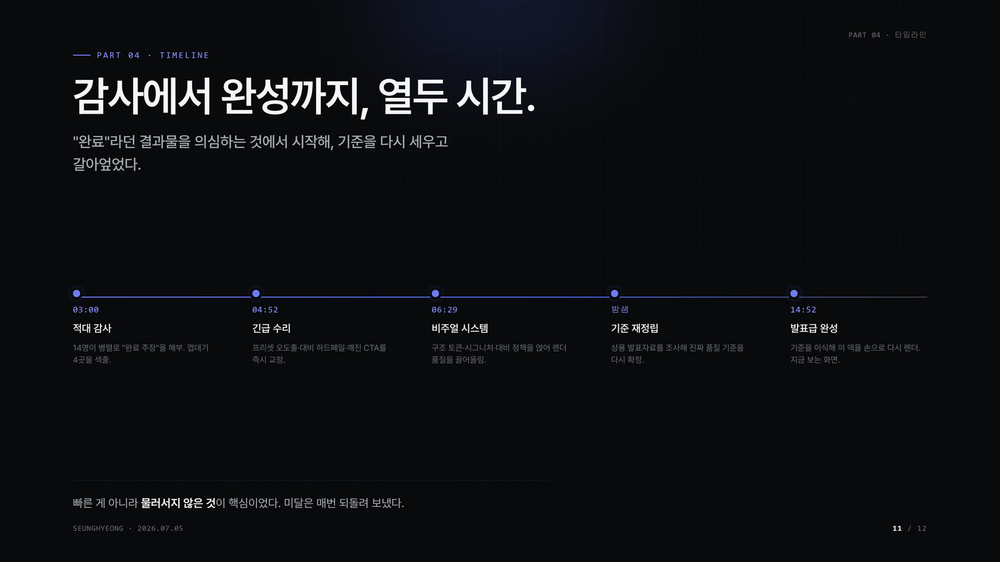
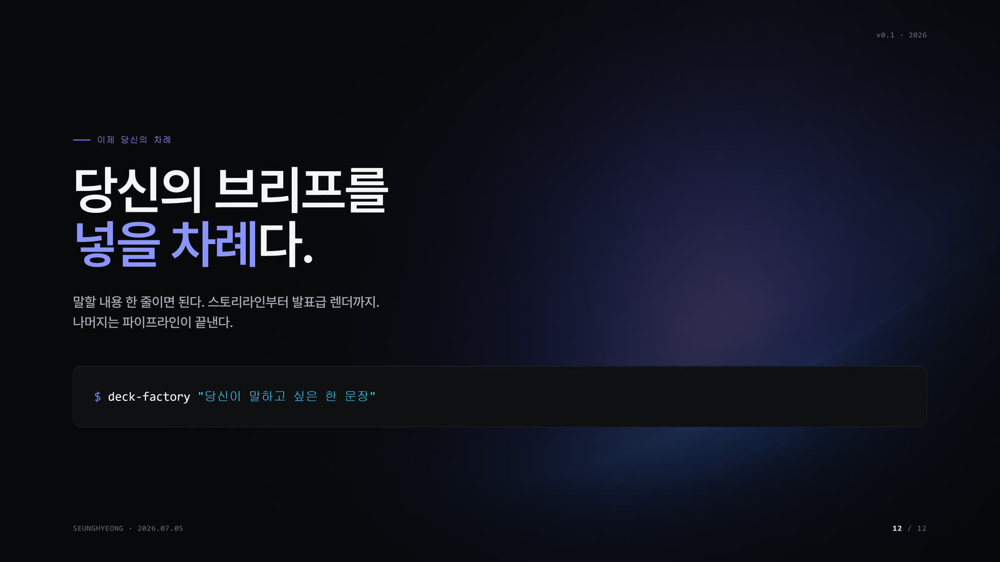

<!-- Language switcher -->
**English** | [한국어](README.ko.md)

<div align="center">

# deck-factory

**One line of intent → a presentation-grade, dark-editorial HTML deck.**

[](https://github.com/kimsh-1/deck-factory/stargazers)
[](LICENSE)
[](skills/deck-factory/SKILL.md)
[](https://claude.com/claude-code)

</div>

<div align="center">


**▶ Watch the full films:**
[Hook · 30s](https://github.com/kimsh-1/deck-factory/releases/download/showcase-v1/01-hook-30s.mp4) ·
[Making-of · 40s](https://github.com/kimsh-1/deck-factory/releases/download/showcase-v1/02-making.mp4) ·
[Usage · 30s](https://github.com/kimsh-1/deck-factory/releases/download/showcase-v1/03-usage-30s.mp4)

</div>

---

## What is this?

You know the pain: it's midnight before the review, and you're still nudging text boxes, fighting gray cards, and shrinking fonts nobody in the back row will read. **deck-factory** replaces that grind with a design system. Give it one sentence about what you want to say, and it builds the front-of-house — a dark-editorial deck with giant numbers, four-corner chrome, hairline structure, and zero amateur boxes — the way Apple, Linear, and Stripe keynotes actually look.

The verified deliverable today: **12 premium slides + 3 motion-graphics films**, all built from this design system. The full generation pipeline (below) is the roadmap that automates it end to end.

## Quick start

```bash
# 1. Add the plugin marketplace
/plugin marketplace add kimsh-1/deck-factory

# 2. Install the skill
/plugin install deck-factory@deck-factory

# 3. Call it with one sentence
/deck-factory "Series A IR deck, 12 slides, why our retention curve wins"
```

> Installation via the plugin marketplace is the intended path. The design system and skill are real and ready to use; the fully-automated one-command pipeline is being wired up (see [How it works](#how-it-works)).

## Features

| | |
|---|---|
| **Dark-editorial design system** | near-black `#08090A` canvas, lavender-blue `#6E7BF2` + cyan `#43C7F4` accents, Pretendard, giant stat numbers. |
| **`no_box` · giant numbers · four-corner chrome** | no gray filler cards — structure comes from hairlines and a surface ladder. 120px+ stat numbers with value > label > context hierarchy. |
| **Quality gate — by design** | 47 deterministic checks across 6 weighted categories (typography, structure, trust, data-viz, color, alignment), a 90-point pass line, and 7 hard-fail thresholds. Autoscoring is calibration-pending; the gate is designed so a sub-grade deck can't quietly reach `final`. |
| **Real Chromium render** | slides are laid out in HTML/CSS and rendered by an actual browser engine — what you see is what exports. |
| **8 style presets** | `apple` · `linear` · `notion` · `stripe` · `vercel` · `krds` · `toss-principles` · `kr-pick`. |
| **CJK-safe** | `keep-all` line-breaking and Hangul break rules — no text shattering mid-syllable. |

## Gallery

Twelve slides, one design system. This is the proof.

| | | |
|:-:|:-:|:-:|
|  |  |  |
|  |  |  |

<details>
<summary><b>Show all 12 slides</b></summary>

| | | |
|:-:|:-:|:-:|
|  |  |  |
|  |  |  |

</details>

## How it works


The design system is here today. The pipeline below is the vision that turns one sentence into a finished deck automatically — a six-stage chain where each stage hands off a file the next one verifies:

1. **storyline** — gather sources and claims from your one-line brief.
2. **copy** — write action titles (declarative, ending in a period — never noun lists).
3. **compose** — deterministically assemble slides from a fixed layout vocabulary (the model writes content; code owns coordinates, color, and z-order).
4. **grade** — run the quality gate; anything below the pass line is quarantined as `draft`, never silently promoted.
5. **render** — lay out and paint via a real Chromium engine.
6. **export** — emit PNG / PDF / PPTX.

Stages storyline through render/export exist as working code in the incubator; end-to-end autoscoring and the final polish pass are the remaining calibration work.

## Design system

The whole look reduces to a few enforced tokens — the skill is the source of truth:

- **Canvas** — `--bg-0: #08090A` (near-black, never pure black), with a surface ladder `#101113 → #1A1B1E → #232427` for depth instead of drop shadows.
- **Accent** — lavender-blue `#6E7BF2` and cyan `#43C7F4`, one accent moment per slide.
- **Ink** — `#FFFFFF` / `#A1A1A6` / `#6B6B70`, a three-step foreground hierarchy.
- **Type** — Pretendard, aggressive negative tracking on display, ≤ 3 font sizes per slide.
- **Structure** — `no_box`, alpha-white hairlines, four-corner chrome (brand chip · section · author · page), one dominant object per slide.

→ Full contract: [`skills/deck-factory/SKILL.md`](skills/deck-factory/SKILL.md)

## Repository layout

```
deck-factory/
├── skills/deck-factory/     # the skill — SKILL.md + assets/styles.css
├── docs/
│   ├── media/               # hero.gif, pipeline.png
│   └── gallery/             # slide-01.jpg … slide-12.jpg
├── videos/                  # the three motion-graphics films
├── design/                  # DECK-STANDARD.md — the quality contract (SSOT)
└── incubator/               # pipeline code: deck-grader, deck-tokens, deck-editor
```

**Customizing:** pick a preset (`/deck-factory "… preset: linear"`), or edit the token values in the skill's stylesheet to retune the palette. Presets change structure and signature devices; color always resolves through token variables.

## Credits & license

Released under the [MIT License](LICENSE).

- **Font** — [Pretendard](https://github.com/orioncactus/pretendard) (SIL Open Font License).
- **Motion** — [GSAP](https://gsap.com) and HyperFrames for the showcase films.

---

<div align="center">

Built with [Claude Code](https://claude.com/claude-code) — powered by the [deck-factory skill](skills/deck-factory/SKILL.md).

**One line in. A deck worth presenting out.**

</div>
